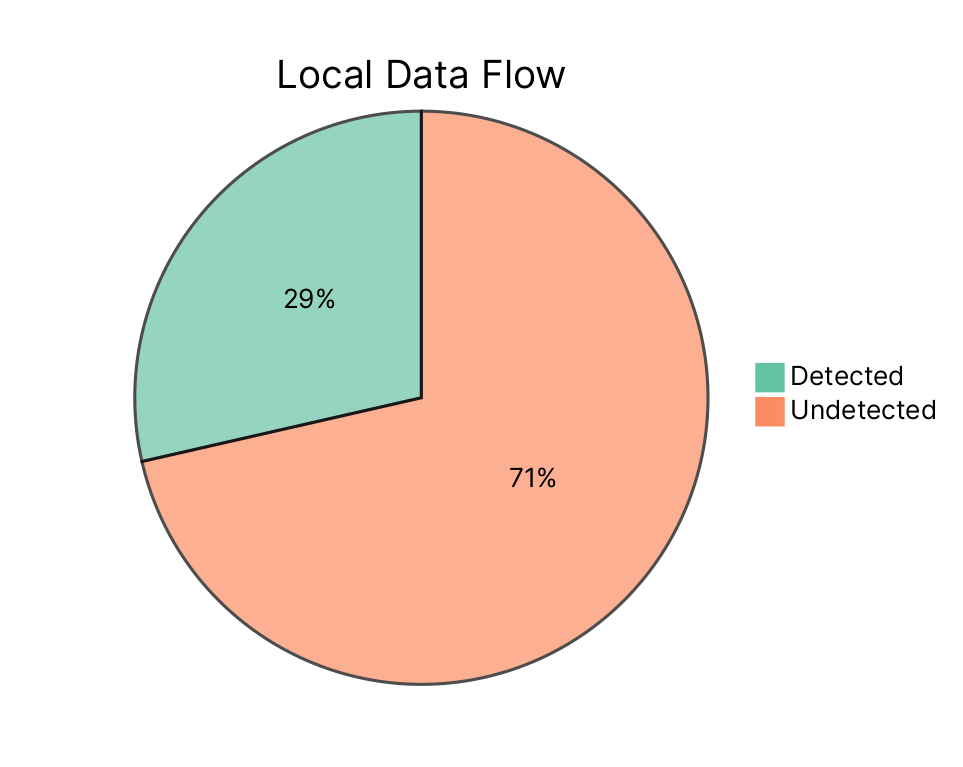
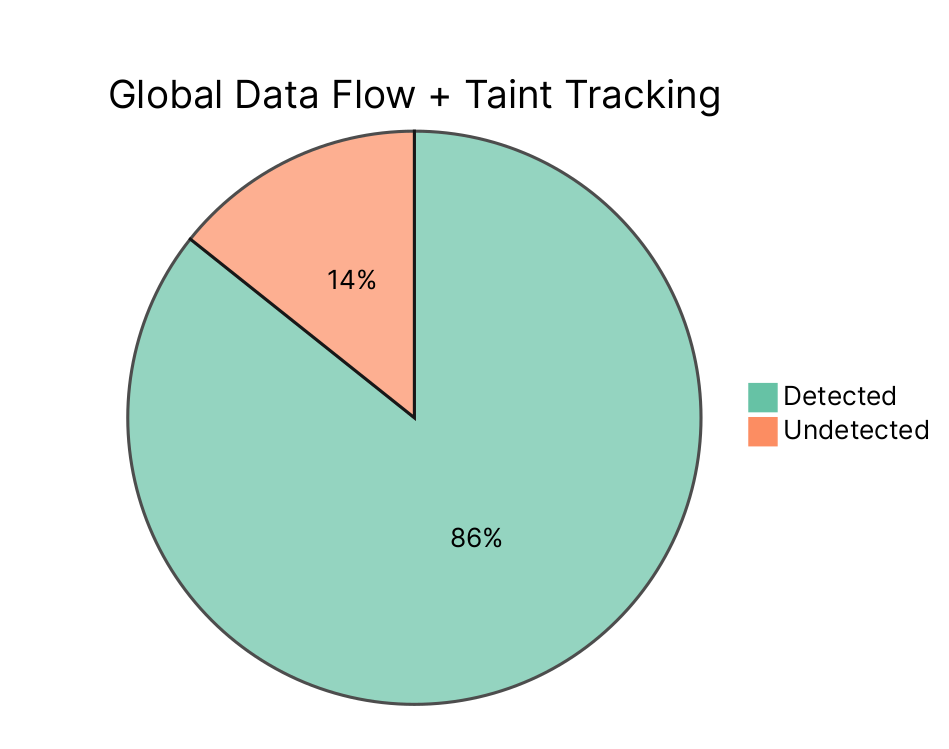

# Finding SQL Injections with Semantic Code Analysis
###### Neal Fennimore
## Abstract
Using a semantic code analysis engine we are able to detect potential SQL injection points within a vulnerable codebase. The results show that by even using a simple test, we can determine that CodeQL can help to inform developers and security professionals about how data flows through their applications. This highlights the potential gains on fixing security issues, by being able to quickly determine all vulnerable code points, with a SQL-like query language.

## Introduction

SQL injections are one of the most prevalent web application vulnerability according the OWASP foundation[^1]. A SQL injection takes user input intended for data retrieval and tricks the database into giving unrestricted data access. According to CWE, SQL injections can be used to circumvent authorization by allowing unintended data leakage, as well as escalation by allowing system commands to be run[^3]. Some forms of SQL injection attacks are using tautologies, using logically incorrect queries, performing union queries, calling stored procedures, and blind injections[^2].

Modern day software applications are complex and often have multiple avenues for user input to make it to a database. If the user input is not properly sanitized, the results can catastrophic. However, pinpointing all the potential entries where this can happen, can be time consuming. That's where a tool such as CodeQL may come into use.

### What is CodeQL?

CodeQL is what's described semantic code analysis engine created by Semmle, which is now owned by Github. It allows for querying a codebase as if it were a database in order to determine certain properties about a codebase. In the purest sense, it does this by reducing the attributes of a language into logic, similar to other declarative query languages, such as Datalog[^7].

In order to begin querying, CodeQL first creates it's own database from source code using a language extractor[^7]. This database contains the entire hierarchy of the source code and how data may flow through to any given branch within the codebase[^4]. Afterwards, a CodeQL query can be written to determine which portion of code (i.e. the source) ends up being used in another location (i.e. the sink). With this, we can then infer if any unsanitized source is allowed to be run directly as a SQL query.

For this research paper, I will be conducting an experiment to see the potential findings of a CodeQL query on a piece of code that I've written to be vulnerable to SQL injection. From there, I will show how effective CodeQL is for determining SQL injection points based on whether the injection point was detected or not.

## Methodology
For finding potential SQL injection points, I've put together a JavaScript file that takes in a command line argument and runs it directly as a SQL query. Using the Node PostgreSQL module, I've constructed a PostgreSQL client that will use this command line argument seven separate times, each utilizing a different language property[^5]. The language properties utilized in the test involve method calls, method calls within a new scope context, queries as a passed reference, static classes, class instances, recursive calls, and expression concatenation. Even though a different language property is used, the end result is the same, the potential SQL injection query command line argument ends being executed by the PostgreSQL database.

```javascript
const { Client } = require('pg');

const client = new Client({
    database: 'postgres',
});

const cliQuery = process.argv[2]; // Our SQL injection query - the source

client.connect();
client.query(cliQuery); // Run the CLI argument directly - a sink
```

## Findings
### Local Data Flow
My first CodeQL query resulted in a poor detection rate, as I was unknowingly not accounting for global data flow. In JavaScript, functions define context (and blocks, as of recent, define lexical scope), but this query was not following passed references of the command line argument.  This was because it was ignoring data flowing into a new function scope. This was due to the fact that logic data flow queries try to speed up query time by not tracking references[^6]. As a result, five out of the seven tests went undetected.

```javascript
from DataFlow::SourceNode arg, DataFlow::CallNode call
where
    arg = DataFlow::globalVarRef("process").getAPropertyRead("argv").getAPropertyReference() and
    call = DataFlow::moduleMember("pg", "Client").getAnInstantiation().getAMemberCall("query") and
    arg.flowsTo(call.getArgument(0))
select call, "Found local CLI input passed into SQL query", arg, "Arg"
```




### Taint Tracking
The second CodeQL resulted in a much better detection rate with only one undetected injection point. It used taint tracking for determining whether the command line argument was passed around as a reference in function calls. This uses global data flow, as well as taint tracking, to keep track of data that could have been mutated in combination with the initial source to then mark it as tainted[^6].  Everything in this test was detected properly except for instantiating a class to run the query.

---

```javascript
class CommandLineSQLQueryConfiguration extends TaintTracking::Configuration {
  CommandLineSQLQueryConfiguration() { this = "CommandLineSQLQueryConfiguration" }

  override predicate isSource(DataFlow::Node source) {
    DataFlow::globalVarRef("process").getAPropertyRead("argv").getAPropertyRead() = source
  }

  override predicate isSink(DataFlow::Node sink) {
    DataFlow::moduleMember("pg", "Client")
		.getAnInstantiation()
		.getAMemberCall("query")
		.getArgument(0) = sink
  }
}

from CommandLineSQLQueryConfiguration cfg, PathNode source, PathNode sink
where cfg.hasFlowPath(source, sink)
select sink.getNode(), source, sink, "CLI input passed into SQL $@.", source.getNode(), "query"
```



## Conclusion
The source of the command line argument being used for SQL injection is a more obscure scenario, but it allowed for a way of dangerous input making it's way into a SQL database. Using CodeQL for SQL injection, resulted in most cases to be detected, when global data flow and taint tracking was utilized. While the class instance injection was not detected in either test, this probably would have been caught with some tweaks to the query to allow for class instance references.

We were able to show that by capturing a snapshot of a code repository, we can write queries that can save developer time, as we can pinpoint security flaws that may have gone unnoticed. This also allows for better remediation on larger codebases, since we can now write a query to find possible issues. 

## References

[^1]: “OWASP Top Ten Web Application Security Risks | OWASP.” [https://owasp.org/www-project-top-ten/](https://owasp.org/www-project-top-ten/) (accessed Mar. 28, 2021).
[^2]: A. Sravanthi, K. J. Devi, K. S. Reddy, A. Indira, and V. S. Kumar, “Detecting SQL injections from web applications,” International Journal Of Engineering Science & Advanced Technology [IJESAT], vol. 2, no. 3, 2012.
[^3]: “CWE - CWE-89: Improper Neutralization of Special Elements used in an SQL Command ('SQL Injection’) (4.4).” https://cwe.mitre.org/data/definitions/89.html (accessed Apr. 08, 2021).
[^4]: “About CodeQL — CodeQL.” https://codeql.github.com/docs/codeql-overview/about-codeql/ (accessed Apr. 08, 2021).
[^5]:“pg,” npm. https://www.npmjs.com/package/pg (accessed Apr. 08, 2021).
[^6]: “About data flow analysis — CodeQL.” https://codeql.github.com/docs/writing-codeql-queries/about-data-flow-analysis/#data-flow-graph (accessed Apr. 09, 2021).
[^7]: P. Avgustinov, O. De Moor, M. P. Jones, and M. Schäfer, “QL: Object-oriented Queries on Relational Data,” p. 25 pages, 2016, doi: 10.4230/LIPICS.ECOOP.2016.2.


